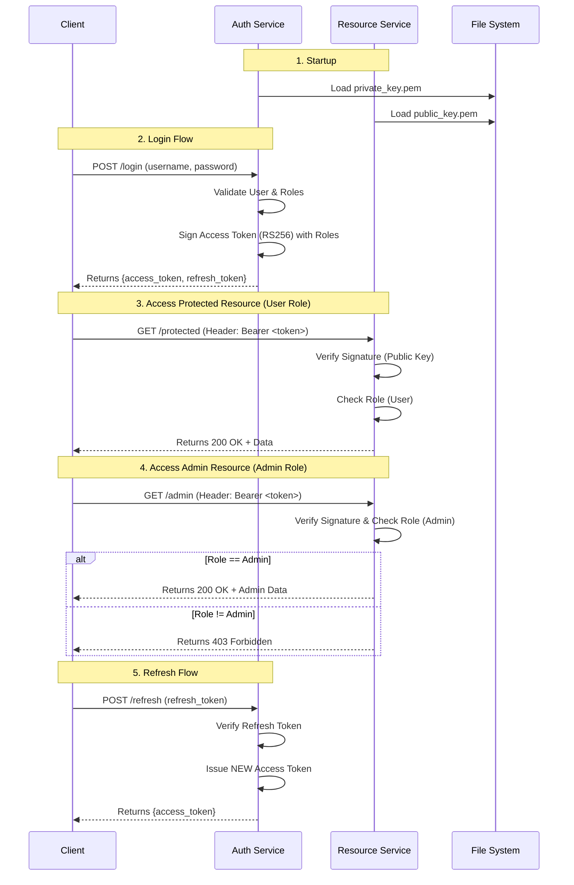

# JWT Authentication Architecture & Flow (File-Based Keys + RBAC)

This document explains the architecture of the JWT Authentication service, using **File-Based Asymmetric Keys** and **Role-Based Access Control (RBAC)**.

## Architecture Overview

1.  **Key Generation**:
    *   `key_generator.py` creates an RSA 2048 Key Pair.
    *   Saves `private_key.pem` and `public_key.pem` to the `keys/` directory.

2.  **Auth Service (Port 5000)**:
    *   **Startup**: Loads `keys/private_key.pem`.
    *   **Login**: Authenticates user, reads roles from `secrets.json`, and includes them in the JWT.
    *   **Refresh**: Validates Refresh Token and issues new Access Token with roles.

3.  **Resource Service (Port 5001)**:
    *   **Startup**: Loads `keys/public_key.pem`.
    *   **Validation**: Verifies tokens using the loaded **Public Key**.
    *   **RBAC**: Enforces role requirements using `@role_required` decorator.

## Application Flow

### Mermaid Diagram

### Detailed PlantUML

For a more detailed view, see **[flow.puml](flow.puml)**.

## Key Concepts

### 1. Asymmetric Keys (RS256)
*   **Auth Service** has the **Private Key** (can create tokens).
*   **Resource Service** has the **Public Key** (can only verify).

### 2. Role-Based Access Control (RBAC)
*   **Roles**: Defined in `secrets.json` (e.g., `admin`, `user`).
*   **Claims**: Roles are embedded in the JWT payload (`"roles": ["admin"]`).
*   **Enforcement**: Resource Service checks the `roles` claim before allowing access to protected endpoints.
