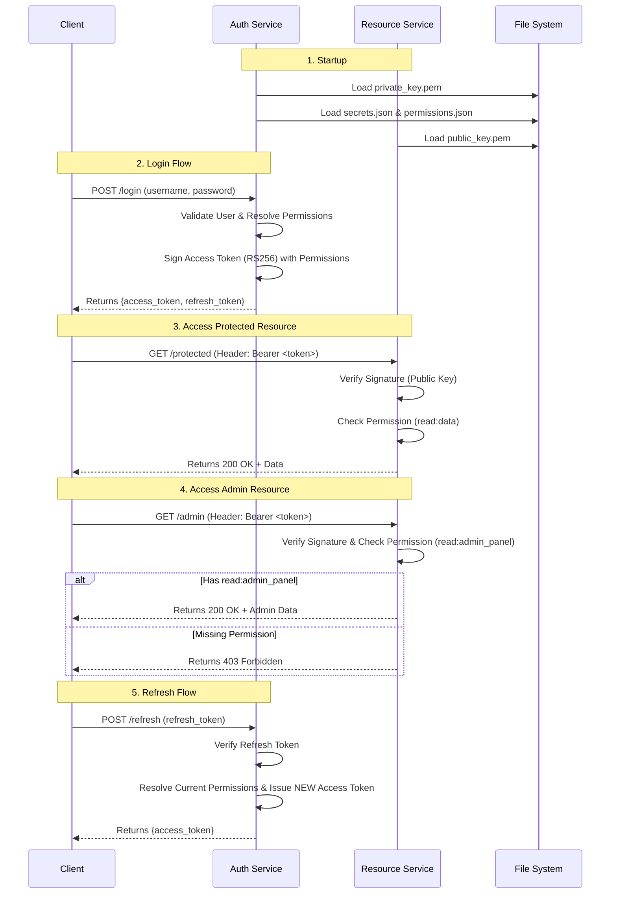

# JWT Authentication Architecture & Flow (Permission-Based RBAC)

This document explains the architecture of the JWT Authentication service, using **File-Based Asymmetric Keys** and **Resource-Based Permission RBAC**.

## Architecture Overview

1.  **Key Generation**:
    *   `key_generator.py` creates an RSA 2048 Key Pair.
    *   Saves `private_key.pem` and `public_key.pem` to the `keys/` directory.

2.  **Auth Service (Port 5000)**:
    *   **Startup**: Loads `keys/private_key.pem`, `auth_service/secrets.json`, and `auth_service/permissions.json`
    *   **Login**: Authenticates user, resolves permissions from roles, and embeds them in JWT
    *   **Refresh**: Validates Refresh Token and issues new Access Token with current permissions

3.  **Resource Service (Port 5001)**:
    *   **Startup**: Loads `keys/public_key.pem`
    *   **Validation**: Verifies tokens using the loaded **Public Key**
    *   **RBAC**: Enforces permission requirements using `@permission_required` decorator

## Application Flow

### Mermaid Diagram

### Detailed PlantUML

For a more detailed view, see **[flow.puml](flow.puml)**.

## Key Concepts

### 1. Asymmetric Keys (RS256)
*   **Auth Service** has the **Private Key** (can create tokens).
*   **Resource Service** has the **Public Key** (can only verify).

### 2. Resource-Based Permissions
*   **Format**: `resource:action` (e.g., `read:data`, `write:admin_panel`, `delete:users`)
*   **Benefits**: 
    - Clear separation between resources and actions
    - One permission can protect multiple endpoints
    - Easy to understand and maintain
*   **Configuration**: Defined in `auth_service/permissions.json`
*   **Embedding**: Permissions are resolved from roles and embedded in JWT at login
*   **Enforcement**: Resource Service checks permissions locally (no API calls)

### 3. Stateless Authorization
*   Permissions are in the JWT token itself
*   No database lookups or external service calls needed
*   Scalable and fast
